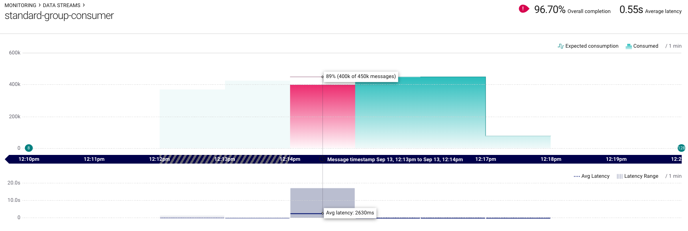
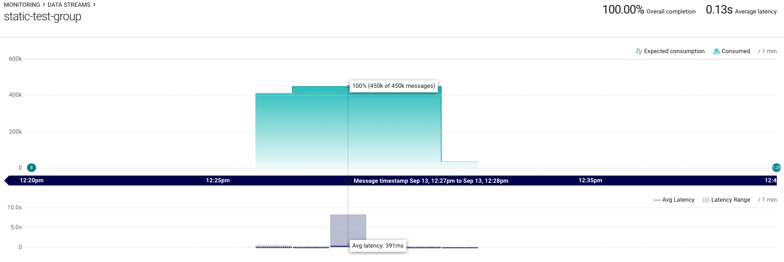

# Static Group

The static group is a way to statically assign consumers within a consumer
group and eliminate costly rebalances. Certain situations call for a
group coordintation strategy like this namely:

 * Large consumer groups where a rebalance requires the corrdination of
   possibly dozens of members, maybe 100+
 * A highly active deployment pipeline is in place triggering entire
   rebalance events whenever changes are pushed, maybe several times a
day
 * Finally a combination of all of the above

What the static group is trying to do is get its group members to spend less time coordinating and more time processing data.
A side effect of this is that latencies are decreased, throughput is increased but the group is dependent on an external scheduler to replace slow or unresponsive group members.
Also members of the group should fail faster rather than attempting to indefinitely recover from external errors. These include:

  - disconnection from the broker
  - disconnection from the coordinator
  - external RPC calls
  - datastore access

## Building

This is built as a python library that can be used within an application.  To build it simply use `pipenv`.

    pipenv install -e .

Conveniently you can also use `make` as long as `pipenv` is installed.

    make install

Along with the library a simple example consumer is supplied that can be execute from the command line once installed. It requires running zookeeper and kafka clusters.

    static-consumer -c myconf.json

An example configuration can be output for tailoring via:

    static-consumer --example

## Docker

If you have docker installed then you can create a docker image for local usage with make.

    make build

With docker-compose available you can bring up a running environment like so:

    make up

The `/config` directory contains files that are used by the docker containers to simplify their startup and configuration management.

## Testing and Performance Review

The tests are built using pytest and can be executed with make.

    make test

There are also some performance tests available but they are mostly for review and are not subject to assertions.
They require docker, docker-compose and the static group docker container to be built.

    make performance-standard

    #or

    make performance-static

## Performance Comparison

Below are two captured images from Confluent Control Center displaying how the standard group coordination compares to the static group coordination when they are being recycled (restarted).

**Standard Group**

**Static Group**

